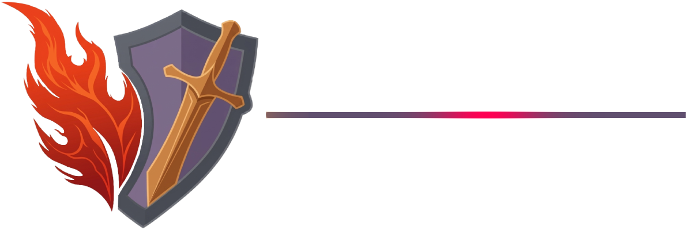
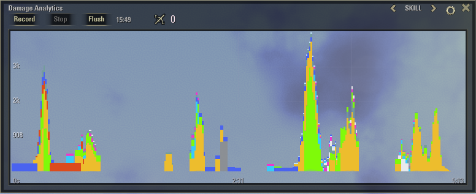
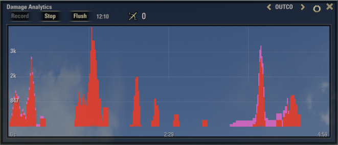
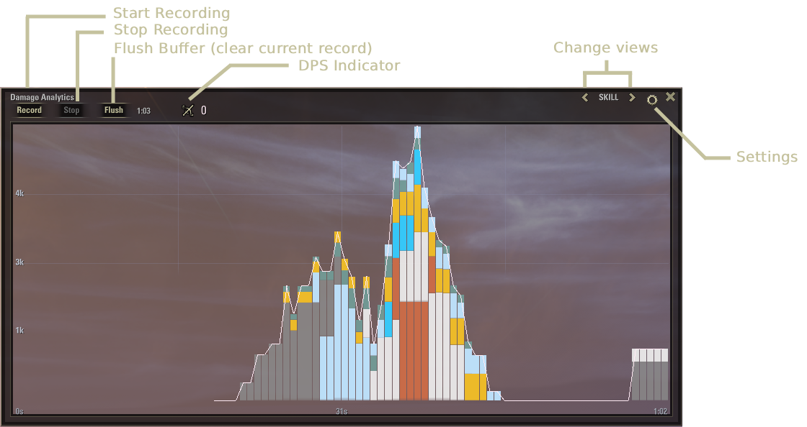
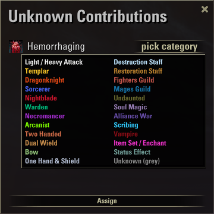
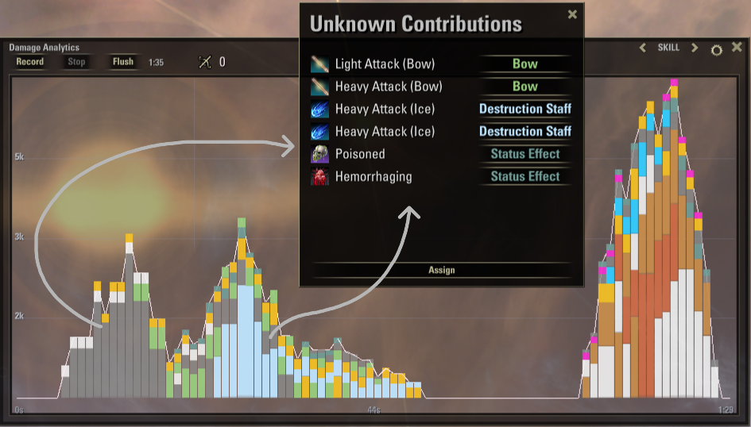
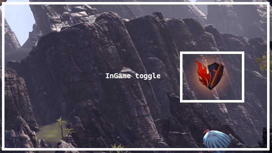

# Vermilion

> *[Verdant](https://github.com/vergelli/verdant)'s evil sister.*

**Real-time damage analytics for The Elder Scrolls Online.**

Vermilion is the crimson twin of **[Verdant](https://www.esoui.com/downloads/info4557-Verdant.html)**, the
healer's addon. 

The spirit of this tool remains the same. Where Verdant counts the life you
give back, Vermilion counts the life you take away, and shows it to you while
the fight is still hot.

---

**One rule: see your damage as it happens.**

- **Live, not a post-fight report.** A moving trend you read while you fight, not a log you open afterward.
- **Lightweight.** Zero-allocation hot path, pooled events, sampled on a fixed interval rather than on every hit. Negligible FPS impact.
- **No dependencies.** No libraries or companion add-ons required.

---

## Two views

One window, two views. Switch with the `‹‹` / `›` arrows in the title bar.

### Skill view: 
your damage stacked and colored by source: class lines, weapons, guilds, status effects, item procs. 
Basically it shows which part of your build is doing the work.

### Outcome view
your output split into two stacked bars:

- **eDPS** *(deep crimson)*: damage landing on the target's health.
- **ShDPS** *(pink-magenta)*: damage absorbed by the target's damage shields.

Useful in PvP and against shield-stacking targets: you can see how much of your damage is being absorbed versus actually dropping health.

---

## Features

- **Live readout (DPS count)** of your current output in the window header, updated each second.
- **Two views** (Skill / Outcome) over a configurable time window.
- **Record / Stop / Flush** to capture and clear a session.
- **Automatic color classification**.
- **Unknown Contributions:** window to asign a group to the few hits the classifier can't recognize (Sets procs mostly, but there are others).
- **Floating button**: movable, optional, click to open the window.
- **Per-server SavedVariables**: (EU / NA / PTS kept separate).

---

## Grey bars (Unknown Contributions)

Vermilion classifies the large majority of your damage automatically. Sadly, a few hits (typically item-set procs and enchant glyphs with generic icons) can't be matched to a skill line and show as a **grey** bar.

To color them: **Settings → Unknown Contributions**, then pick a category for each from the list. It saves and applies live, (no reload needed).

> **Note.** Grey means Vermilion couldn't attribute the hit to a skill line. Usually an item-set proc. ESO exposes no ability → set mapping, so attributing every proc manually is out of scope to maintain. The assignment window lets you color them yourself if you want.

---

## Floating button

A movable button on the HUD. Click it to open the window. Drag it anywhere, or disable it in Settings to use a keybind instead.

---

## Installation

1. Download the latest release.
2. Drop the `Vermilion` folder into your AddOns directory
3. Enjoy

---

## Usage

| Action | How |
|---|---|
| Open / close the window | Click the logo, type `/vermilion`, or bind a key |
| Bind a key | Settings → Controls → Keybindings → Add-Ons → *Toggle Vermilion Window* |
| Switch views | The `‹‹` / `›` arrows in the title bar |
| Record a session | **Record**, then **Stop** / **Flush** to clear |
| Open settings | The ⚙ gear in the window |
| Color an unknown hit | Settings → **Unknown Contributions** |
| Show / hide the logo | Settings → **Logo** |

`/vermilion help` lists the commands in chat.

---

## Settings

- **Sampling Rate** — how often the graph takes a reading (1–10 Hz).
- **Time Window** — how much history it holds (15 s – 10 min).
- **Viewport Alpha** — graph background opacity.
- **Logo** — show or hide the floating logo.
- **Unknown Contributions** — the color-assignment window.

---

## Compatibility

- No dependencies.
- SavedVariables kept per server (EU / NA / PTS).
- PvE and PvP alike — the Outcome view earns its keep in PvP.

---
