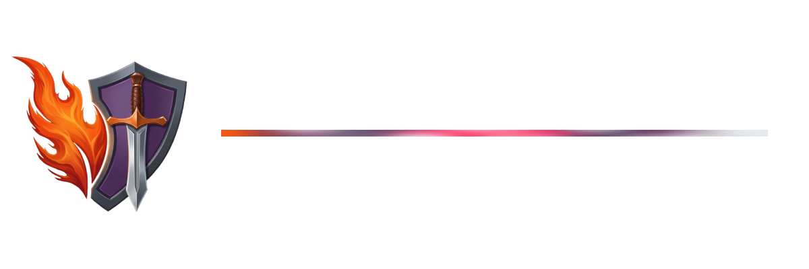
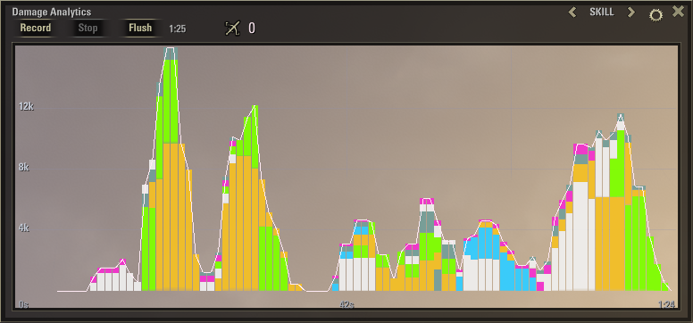
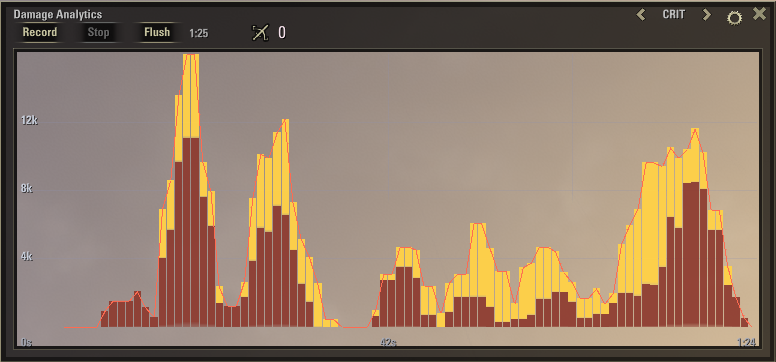

# Vermilion




> *[Verdant](https://github.com/vergelli/verdant)'s evil sister.*

**Real-time damage analytics for The Elder Scrolls Online**

Vermilion is the crimson twin of **Verdant**, the healer's addon. The spirit is the same — where Verdant counts the life you give back, Vermilion counts the life you take away, and shows it to you while the fight is still hot.

---

## Contents

- [Philosophy](#philosophy) — what Vermilion is and isn't
- [Installation](#installation)
- [The Graph Window](#the-graph-window) — recording, the three views
- [Skill Colors & Unknown Contributions](#skill-colors--unknown-contributions)
- [Settings](#settings)
- [Usage](#usage) — commands and keybinds
- [Core Metrics](#core-metrics) — eDPS, ShDPS, EOS
- [Known Limitations](#known-limitations)
- [License](#license)

---

## Philosophy

**One rule: see your damage as it happens.**

- **Live, not a post-fight report.** A moving trend you read while you fight. Not a log you open afterward.
- **No dependencies.** No libraries, no companion add-ons. One folder, drop it in, done.

---

## Installation

1. Download the latest release from ESOUI or [GitHub](https://github.com/vergelli/vermilion).
2. Drop the `Vermilion` folder into your AddOns directory:
   ```
   Documents/Elder Scrolls Online/live/AddOns/Vermilion/
   ```
3. Reload with `/reloadui` or restart the game.
4. The floating logo appears — click it to open the window, or bind a key.

> Vermilion stores settings and data **per server** — your EU, NA and PTS profiles stay separate.

---

## The Graph Window

One window, a live DPS readout in the header, and three views. It's movable, resizable, and remembers its place per account.


**Controls:**

| Button | Action |
|---|---|
| **Record** | Begin capturing samples |
| **Stop** | Stop recording (existing samples stay visible) |
| **Flush** | Stop recording and clear the session |
| **‹‹** view **›** | Cycle between the three views |

### Views

**SKILL** — your damage stacked and colored by source: class lines, weapons, guilds, status effects, item procs. It shows which part of your build is doing the work.



**CRIT** — your landed damage split into its non-critical base  and its critical cap . Read your crit ratio at a glance and watch it move across a fight.



**OUTCOME** — your output split into two stacked bars: 

 -  **eDPS** — landing on the target's health
 -  **ShDPS** — absorbed by the target's damage shields
 
 Against shield-stacking targets you can see how much of your damage is being eaten versus actually dropping health.


---

## Skill Colors & Unknown Contributions

In the **SKILL** view, every segment is colored by the **class**, **weapon**, **guild**, or **skill line** the ability belongs to, so you can see which source carries your damage.

A few hits — typically item-set procs and enchant glyphs with generic icons — can't be matched to a skill line and show up **grey**. To color them yourself: open **Settings → Unknown Contributions**, pick a category for each, and it applies live (no reload).


> **Why grey?** ESO exposes no ability-to-set mapping, so attributing every proc automatically is out of scope to maintain. The assignment window lets you label the handful Vermilion can't, and it persists.


---

## Settings

Open the **⚙ gear** in the window. All values are saved per account.

- **Sampling Rate** — how often the graph takes a reading (1–10 Hz).
- **Time Window** — how much history it holds (15 s – 10 min).
- **Viewport Alpha** — graph background opacity (0–100%).
- **Logo** — show or hide the floating logo.
- **Unknown Contributions** — the color-assignment window.

> A long window combined with a high sample rate produces a heavy buffer (`time_window_s × sample_hz`). Very high combinations ask the chart to draw thousands of samples per frame and can cost FPS. For now, favor lower sample rates for long windows — a future version will draw long buffers far more efficiently.

---

## Usage

| Action | How |
|---|---|
| Open / close the window | Click the logo, type `/vermilion`, or bind a key |
| Bind a key | **Controls → Keybindings → Add-Ons → Toggle Vermilion Window** |
| Switch views | The **‹‹** / **›** arrows in the title bar |
| Record a session | **Record**, then **Stop** / **Flush** |
| Open settings | The **⚙** gear icon |
| Color a grey hit | **Settings → Unknown Contributions** |
| Show / hide the logo | **Settings → Logo** |


`/vermilion help` lists the commands in chat.

---

## Core Metrics

Three numbers describe your output, mirroring Verdant's healing trio.

**eDPS — Effective Damage Per Second.** Damage that lands on the target's health.

**ShDPS — Shield Damage Per Second.** Damage absorbed by the target's damage shields (your "shield-cracking" pressure).

**EOS — Effective Output Score.** The combined metric, shown live in the header:

$$EOS = eDPS + ShDPS$$

Against an unshielded target, EOS and eDPS are the same. The gap between them *is* the damage being eaten by shields. Exactly what the Outcome view draws.

---

## Known Limitations

- **Ability classification is heuristic.** A few hits (set procs, generic-icon enchants) may show grey until labeled. Use **Unknown Contributions** to color them yourself.
- **Damage attribution follows ESO's source tags.** Vermilion counts hits the game attributes to you; environmental and clearly foreign sources are filtered out.
- **Very heavy buffers cost FPS.** Maxing sample rate and time window together asks the chart to draw thousands of samples per frame. Keep an eye on the recommended combinations.
