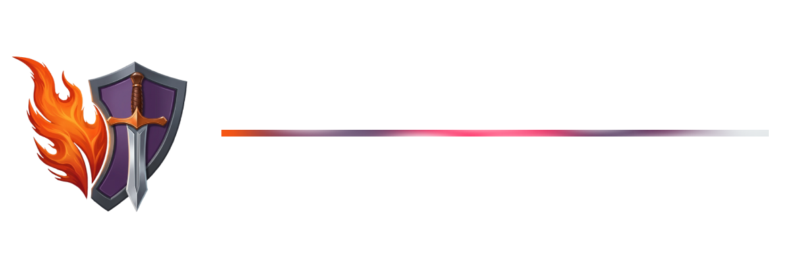
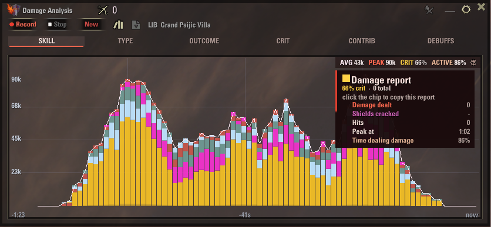
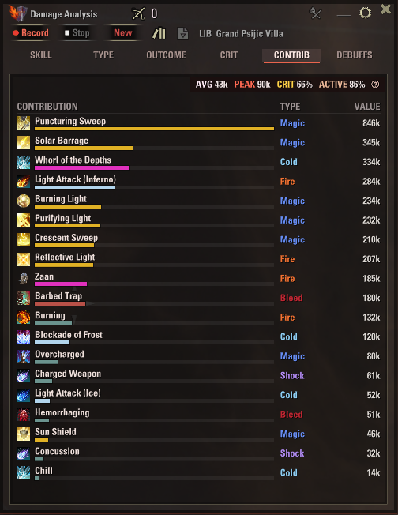
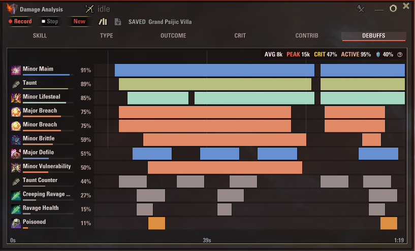
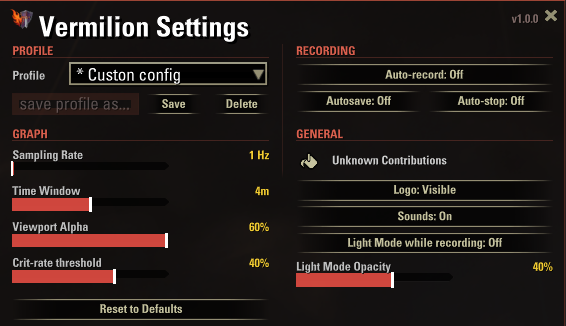

# Vermilion

A damage tracker for The Elder Scrolls Online. It records what your damage and shield-cracking did during a fight, then shows you which skills carried it, what kind of damage it was, and which debuffs you kept on the enemy.

The crimson twin of [Verdant](https://github.com/vergelli/verdant).

- [Install](#install)
- [The graph](#the-graph)
- [The report](#the-report)
- [Session library](#session-library)
- [Settings](#settings)
- [Commands and keys](#commands-and-keys)
- [What the numbers mean](#what-the-numbers-mean)
- [License](#license)

## Install

Download from [ESOUI](https://www.esoui.com/downloads/info4616-Vermilion.html) or from the [releases page](https://github.com/vergelli/Vermilion/releases), extract into `Documents/Elder Scrolls Online/live/AddOns/`, then `/reloadui`.

A small logo appears. Click it to open the graph window, or bind a key. Settings and data are kept per server, so EU, NA and PTS stay separate.

## The graph

Press **Record** before a fight, **Stop** after it. **New** clears the plot for the next one. There is also a keybind for start and stop under Controls, and an auto-record option for boss fights or any combat.

Six views share one window. Click a tab, or use the Next and Previous view keybinds.

**SKILL** stacks your damage by class or skill line. Hover a bar to see which abilities were doing the work at that moment. The number next to the sword is your live output.

**CONTRIB** ranks your abilities by the damage they dealt over the window, with the damage type of each and a bar proportional to the top row. Hover a row for its share; the mouse wheel scrolls when the list does not fit.

**TYPE** stacks the same damage by damage type: fire, shock, poison, bleed, physical, magic and the rest. **CRIT** separates the critical part of your damage.

**PRESSURE** shows your damage pressure per enemy over time: one lane per target, ordered by the damage they took, each cell hotter where you hit harder. A bar chart on the right, row by row, is the accumulated pressure per enemy, with an orchid tail for the part a shield absorbed. It answers whether you focused or spread your damage, when you switched targets, and against whom your damage went into wards. Hover a cell for the numbers at that moment and the shields involved. Enemies that share a name fold into one lane with a count, so a pull of mobs stays readable; enemy players always keep their own lane.

A skull marks every killing blow you land: at the top of the plot in SKILL, TYPE and CRIT, and on the victim's lane in PRESSURE. Hover it for the victim and the ability.

In SKILL and TYPE, a faint orchid layer hangs from the top of the plot: its depth is the damage a shield absorbed at that moment, on the same scale as the bars. The bars below are your own damage, absorbed part included. Above every plot view, the ultimate band shows the charge of each bar over time, bright when ready, with a tick at every cast.

**DEBUFFS** shows the uptime of the debuffs you put on enemies: one lane per debuff, brighter when more targets carry it at once, folded into an "always on" strip when a debuff stayed up the whole fight. Lanes are coloured by skill line where the debuff has one, and by family otherwise: warm for Major and Minor offense debuffs like Breach and Brittle, blue for defense ones like Maim, mint for sustain, ember for status effects like Burning and Poisoned, khaki for taunts and control. Your own skill effects are not listed here; their damage is in SKILL and CONTRIB.

## The report

After Stop, the chip in the top corner sums up the recording: average, peak, crit rate, active time and shield share. Hover it for the full report, which adds the enemy you focused most, the time spent on your main target, how many times the pressure moved, the shield that absorbed the most, your killing blows and, when the band has data, how long the ultimate sat ready and how many casts. Click the chip to copy the text into chat.

## Session library

Every recording can be kept. With Autosave on it happens on Stop; otherwise press the save icon. Open the library from the graph window to reopen a fight, name it, lock it so it never rotates out, or delete it. Double-click a row to open it. Each row shows the kind of content it was recorded in, with a veteran badge where it applies.

## Settings

The gear icon opens the settings. Every value is saved per server.

**Profile.** Save the sliders under a name and switch between your own profiles. Touching a slider switches the profile to Custom.

**Sampling Rate.** How often the graph takes a reading, 1 to 5 Hz. One reading per second covers everything.

**Time Window.** How much history the live graph holds, 15 seconds to 20 minutes. A stopped recording keeps whatever it captured.

**Viewport Alpha.** The opacity of the plot background.

**Crit-rate threshold.** The crit rate you aim for. The live crit readout turns green above it and red below.

**Auto-record.** Off, boss fights, or any combat. Vermilion starts recording on its own and stops a few seconds after combat ends.

**Autosave.** Keep every recording in the library when it stops.

**Auto-stop.** Stop a recording you started by hand a few seconds after combat ends.

**Unknown Contributions.** Give a colour to the few abilities Vermilion cannot place on a skill line, usually set procs and enchant glyphs. Applied live, remembered.

**Logo.** Show or hide the floating logo.

**Sounds.** Vermilion's own clicks, chimes and window sounds.

**Kill markers.** Show or hide the killing-blow skulls on the plots. The report counts them either way.

**Light Mode while recording** and its **Opacity.** While recording, the chrome folds away and only the plot stays on screen, dimmed to the chosen opacity; it comes back on hover.

**Reset to Defaults.** Puts every setting back.

A fast sampling rate on a long window costs frames. If you combine them the sliders turn amber and Vermilion asks you to confirm.

## Commands and keys

| What | How |
|---|---|
| Open or close the graph | `/vermilion`, the logo, or the keybind under Controls |
| Start or stop recording | The buttons, or the keybind |
| Save a recording | The save icon, or the keybind |
| Open the session library | `/vermilion lib`, or the book icon in the graph |
| Next or previous view | The tabs, or the keybinds |
| Close settings or the library | Its **x**, or Escape |
| Colour a grey ability | Settings, Unknown Contributions |
| List all commands | `/vermilion help` |

## What the numbers mean

- **eDPS** is damage that landed on the target's health.
- **ShDPS** is damage a shield on the target absorbed.
- **EOS** is the two added together. It is the number in the header.
- Vermilion counts the hits the game attributes to you. Reactive procs and reflects that the engine files under your name show up as yours.

Vermilion does nothing with your healing. That is what Verdant is for.

## License

MIT. Source on [GitHub](https://github.com/vergelli/Vermilion). Forks and pull requests are welcome.
